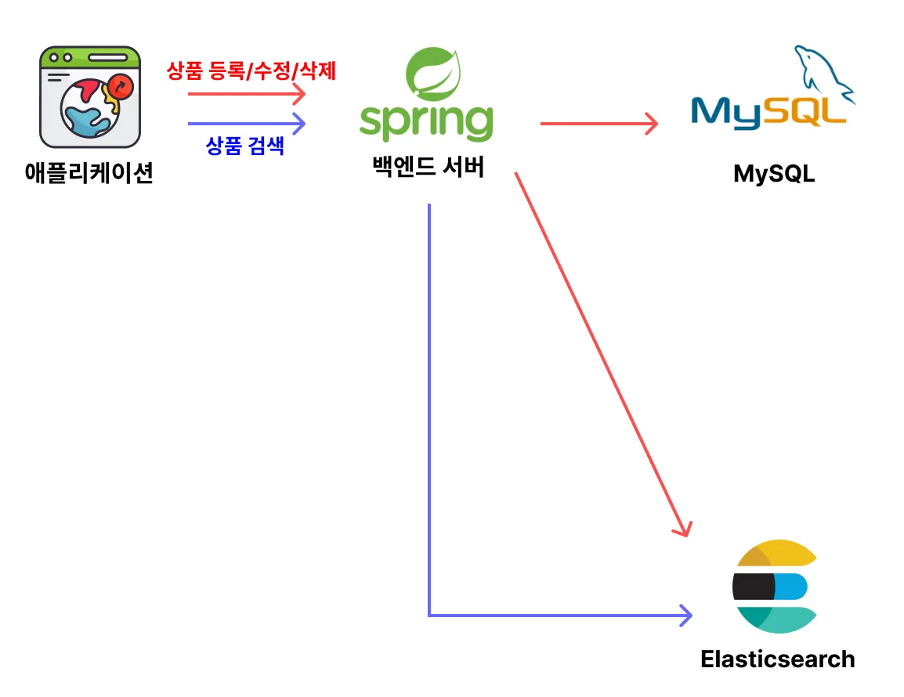

## ✅ MySQL, Elasticsearch 설치
- Docker를 이용해 MySQL, Elasticsearch 설치
- Dockerfile Nori Analyzer 플러그인 추가

## ✅ 요구사항 추가
1. **검색 기능**
    - [ ]  검색을 했을 때 `상품명`, `상품 설명`, `카테고리명`을 기반으로 관련된 상품을 검색해야 한다.
        - [ ]  **상품명 : 상품 설명 : 카테고리명**의 score 가중치를 **3 : 1 : 2**로 설정하기
    - [ ]  대소문자 구분없이 검색할 수 있어야 한다.
    - [ ]  단어의 순서에 상관없이 검색할 수 있어야 한다.
        - ex) `삼성 노트북`이라는 상품을 `노트북 삼성`이라고 검색해도 조회가 되야 한다.
    - [ ]  `상품 설명`에 HTML 태그가 섞여서 저장되어 있는데, 검색할 때는 HTML 태그로 검색되지 않아야 한다.
    - [ ]  한글, 영어 둘 다 검색이 잘 돼야 한다.
    - [ ]  `상품명`에 대해서는 아래 값을 동의어로 인식할 수 있어야 한다.
        
        ```json
        samsung, 삼성
        apple, 애플
        노트북, 랩탑, 컴퓨터, computer, laptop, notebook
        전화기, 휴대폰, 핸드폰, 스마트폰, 휴대전화, phone, smartphone, mobile phone, cell phone
        아이폰, iphone
        맥북, 맥, macbook, mac
        ```
        
    - [ ]  카테고리, 가격으로 필터링을 할 수 있어야 한다.
        - 특정 카테고리 내에서만 검색할 수 있어야 한다.
        - 특정 가격 범위 내에서만 검색할 수 있어야 한다.
    - [ ]  되도록이면 검색 결과 중 평점이 4.0이 넘는 상품을 상위에 노출시킬 수 있도록 한다.
    - [ ]  검색어에 어느 정도 오타가 있더라도 유사한 상품을 조회할 수 있어야 한다.
        - ex) `samsung notebook`이라는 상품을 `simsung notebook`이라고 검색해도 조회가 되야 한다.
    - [ ]  `상품명`에서 일치하는 검색 키워드는 하이라이팅 처리( `<b></b>`)를 해야 한다.
    - [ ]  상품이 5개씩 조회되도록 페이지네이션 해야 한다.
    
2. **자동 완성 기능**
    - [ ]  `상품명`으로만 자동 완성이 되도록 해야 한다.
    - [ ]  자동 완성 결과가 5개만 조회되도록 설정해야 한다.

## ✅ 인프라 아키택처
- kafka를 사용하지 않고 MySQL에 데이터 삽입/삭제 시 Elasticsearch에도 같이 반영되게 설계

